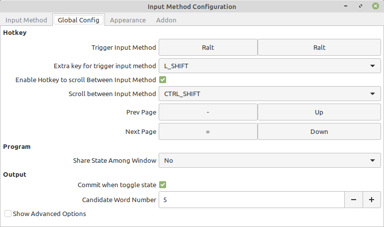

# 초기설정

## 그래픽카드 드라이버 설치

Linux Mint 기준 Settings -> Driver manager 에서 적절한 드라이버 설치 후 reboot

.png>)

## 커널 및 리눅스 패키지 업데이트&#x20;

```
sudo apt update
sudo apt upgrade
```

명령어로 업데이트를 하거나&#x20;

작업 표시줄의 방패모양을 클릭하여&#x20;

.png>)

위와 같은 창에서 Install Updates를 통해 설치

## 한글 입력

Settings -> Languages

.png>)

위 화면에서 Install /remove Languages

.png>)

위 화면에서 영어 (미국) 과 Korean 선택하여 설치

Settings -> Input Method

.png>)

Korean 선택 후  support packages 설치 후 **Input method freamework를 Fcitx 로 변경 후 재부팅**

터미널에&#x20;

```
fcitx-configtool
```

명령을 통해 설정 창 실행

.png>)

처음 실행시 English 밖에 없을 텐데 + 클릭후 hangul 검색 ( 이때 Only Show Current Language 선택 해제) 후 추가



Global Config 탭에서 Trigger Input Method를 좌우 모두 한/영 키로 변경 후 프로그램 종료 하면 한/영 키로 변경하여 한글입력 가능 (fcitx 가 좀 느려서 한영 변환시 1초 정도 걸림)


[https://askubuntu.com/questions/77475/i-encountered-a-gconf2-error-while-installing-some-packages-what-should-i-do](https://askubuntu.com/questions/77475/i-encountered-a-gconf2-error-while-installing-some-packages-what-should-i-do)
